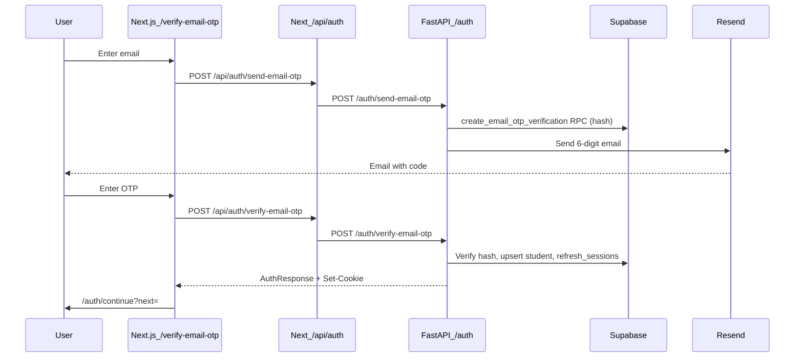

# Email OTP Auth (Resend)

Complete guide for BandForge email login/signup via Resend 6-digit OTP.

**Scope:** email login **or** register with a verified email address.  
**Not in scope:** magic-link verification (`/verify-email?token=`), Supabase Auth / GoTrue email OTP.

Supabase Postgres stores **hashed** codes in `email_otp_verifications` only — delivery is via **Resend**.

---

## 1. Overview

Users enter an email address, receive a **6-digit** OTP via Resend, then verify the code. On success the API:

1. Creates a new student (if email is new) or loads the existing student
2. Sets `users.email_verified_at`
3. Issues JWT access + refresh tokens
4. Sets httpOnly cookies `bf_access` and `bf_refresh`

Primary auth remains Google OAuth. Email OTP is **feature-flagged** and off by default.



Post-login orchestration matches Google: lead sync, diagnostic-first routing, checkout resume.

---

## 2. Prerequisites checklist

| # | Requirement | Notes |
|---|-------------|--------|
| 1 | Migrations applied | `20260819051555_email_otp_verifications.sql`, `20260819055111_email_otp_increment_attempt_rpc.sql` |
| 2 | Backend running | FastAPI with valid `SUPABASE_*`, `JWT_SECRET`, `JWT_REFRESH_SECRET` |
| 3 | Frontend running | Next.js with `API_URL` / `NEXT_PUBLIC_API_URL` pointing at the API |
| 4 | Feature flags | Backend `EMAIL_OTP_ENABLED=true` **and** frontend `NEXT_PUBLIC_EMAIL_OTP_ENABLED=true` |
| 5 | Resend account | API key + verified sending domain (production) |
| 6 | Student-only | Admin accounts receive **403** on verify |

---

## 3. Environment variables

### Backend (`backend/.env`)

| Variable | Required | Default | Purpose |
|----------|----------|---------|---------|
| `EMAIL_OTP_ENABLED` | Yes to enable | `false` | Gate for send/verify email OTP APIs |
| `RESEND_API_KEY` | Prod / real email | `""` | Resend API key |
| `EMAIL_FROM` | Prod / real email | `BandForge <onboarding@resend.dev>` | From address (must be verified domain in prod) |
| `AUTH_DEMO_OTP` | Local only | `""` | Fixed OTP when set (e.g. `123456`) — enables demo mode when non-empty |
| `AUTH_DEMO_OTP_ENABLED` | Local only | `true` | Enables demo mode (fixed/open OTP shortcuts) |
| `AUTH_OPEN_OTP` | Local only | `false` | If true **and** demo mode: any code accepted on verify |
| `APP_ENV` | — | — | `production` enforces Resend + blocks demo flags at startup |

**Demo vs production-like behavior:** Demo mode is controlled by **`AUTH_DEMO_OTP`**, **`AUTH_DEMO_OTP_ENABLED`**, and **`AUTH_OPEN_OTP`** — not by `APP_ENV=development` alone. With all demo flags off, local dev sends **random** codes via Resend and returns `"OTP sent."` (fail-closed on send errors). See [`app/auth/demo_mode.py`](../app/auth/demo_mode.py).

### Frontend

| Variable | Required | Default | Purpose |
|----------|----------|---------|---------|
| `NEXT_PUBLIC_EMAIL_OTP_ENABLED` | Yes to show UI | `false` | Shows `/verify-email-otp` and login/signup links |
| `NEXT_PUBLIC_API_URL` / `API_URL` | Yes | — | Backend base URL for BFF proxy |

See also `backend/.env.example`.

### Local demo (no real email)

```bash
# backend/.env
EMAIL_OTP_ENABLED=true
AUTH_DEMO_OTP=123456
AUTH_DEMO_OTP_ENABLED=true
# RESEND_API_KEY optional — email is skipped in non-production when unset

# frontend/.env.local
NEXT_PUBLIC_EMAIL_OTP_ENABLED=true
NEXT_PUBLIC_API_URL=http://127.0.0.1:8000
```

Restart both API and Next.js after changing env.

### Production-like local (real Resend, no demo)

```bash
# backend/.env
APP_ENV=development
EMAIL_OTP_ENABLED=true
RESEND_API_KEY=re_...
EMAIL_FROM=BandForge <onboarding@resend.dev>   # sandbox: verified recipients only
AUTH_DEMO_OTP=
AUTH_DEMO_OTP_ENABLED=false
AUTH_OPEN_OTP=false

# frontend/.env.local
NEXT_PUBLIC_EMAIL_OTP_ENABLED=true
NEXT_PUBLIC_API_URL=http://127.0.0.1:8000
```

Response message: `"OTP sent."` — random 6-digit code in inbox. Resend sandbox with `onboarding@resend.dev` only delivers to verified addresses (add recipients in Resend dashboard).

### Real Resend (staging / pre-prod)

```bash
# backend/.env
EMAIL_OTP_ENABLED=true
RESEND_API_KEY=re_...
EMAIL_FROM=BandForge <noreply@matalabs.io>
AUTH_DEMO_OTP_ENABLED=false
AUTH_OPEN_OTP=false
AUTH_DEMO_OTP=

# frontend
NEXT_PUBLIC_EMAIL_OTP_ENABLED=true
```

**Do not** use `onboarding@resend.dev` as `EMAIL_FROM` in production — verify **matalabs.io** in Resend first:

1. Resend → **Domains** → Add `matalabs.io`
2. Add DNS records (SPF, DKIM) at your DNS provider
3. Wait for **Verified** status
4. Set `EMAIL_FROM=BandForge <noreply@matalabs.io>`

### Production (Railway + Vercel — deploy when ready)

```bash
# Railway
APP_ENV=production
EMAIL_OTP_ENABLED=true
RESEND_API_KEY=...
EMAIL_FROM=BandForge <noreply@matalabs.io>
AUTH_DEMO_OTP_ENABLED=false
AUTH_OPEN_OTP=false
AUTH_DEMO_OTP=

# Vercel (Production + Preview — redeploy required)
NEXT_PUBLIC_EMAIL_OTP_ENABLED=true
NEXT_PUBLIC_API_URL=https://backend-production-a813.up.railway.app
```

Flip **both** OTP flags together. Keep production `NEXT_PUBLIC_EMAIL_OTP_ENABLED=false` until intentional launch.

---

## 4. BandForge APIs

Base path on FastAPI: `/auth`  
Browser / Next client calls the BFF proxy: `/api/auth/...`.

### 4.1 Send email OTP

| | |
|--|--|
| **Method** | `POST` |
| **Backend** | `/auth/send-email-otp` |
| **Via Next** | `/api/auth/send-email-otp` |
| **Auth** | None |
| **Rate limit** | 5 / 15 min per email; 5 / 15 min per IP; 60s resend cooldown |

**Request**

```json
{
  "email": "student@example.com"
}
```

Email is normalized (trim + lowercase).

**Success `200`**

```json
{
  "ok": true,
  "message": "OTP sent."
}
```

**Errors**

| Status | When |
|--------|------|
| `422` | Invalid email |
| `429` | Resend cooldown, per-email limit, or per-IP limit |
| `503` | `EMAIL_OTP_ENABLED=false`, Resend missing in production, send failed |

### 4.2 Verify email OTP

| | |
|--|--|
| **Method** | `POST` |
| **Backend** | `/auth/verify-email-otp` |
| **Via Next** | `/api/auth/verify-email-otp` |
| **Auth** | None |

**Request**

```json
{
  "email": "student@example.com",
  "code": "123456"
}
```

Code must be exactly **6 digits**.

**Success `200`** — `AuthResponse` + `Set-Cookie` (`bf_access`, `bf_refresh`, `bf_has_session`).

Frontend redirects to `/auth/continue?next=` (default `/dashboard`; signup links pass `next=/diagnostic`).

**Errors**

| Status | When |
|--------|------|
| `401` | Invalid or expired OTP |
| `403` | Admin account or deactivated user |
| `503` | Feature disabled |

---

## 5. Limits and security

| Limit | Value |
|-------|-------|
| Code length | 6 |
| Expiry | 5 minutes |
| Max verify attempts | 5 |
| Resend cooldown | 60 seconds |
| Sends per email | 5 / 15 minutes |
| Sends per IP (send) | 5 / 15 minutes |

Storage: hash-only in `email_otp_verifications` via RPCs (`create_email_otp_verification`, `increment_email_otp_attempt`, etc.).

Implementation: [`backend/app/auth/email_otp.py`](../app/auth/email_otp.py), [`backend/app/auth/service.py`](../app/auth/service.py).

---

## 6. Staging go-live checklist

1. Migrations `20260819051555` + `20260819055111` applied on Supabase staging
2. Resend domain **matalabs.io** verified; `EMAIL_FROM=BandForge <noreply@matalabs.io>` (not `onboarding@resend.dev`)
3. Set `EMAIL_OTP_ENABLED=true` on Railway staging API
4. Set `NEXT_PUBLIC_EMAIL_OTP_ENABLED=true` on Vercel staging/preview and **redeploy**
5. Manual E2E: login → email OTP → `/auth/continue` → diagnostic or dashboard
6. Confirm disabled state: flags `false` → API **503**, UI shows unavailable screen
7. Production: keep both flags `false` until intentional launch

### Rollback

Set `EMAIL_OTP_ENABLED=false` and `NEXT_PUBLIC_EMAIL_OTP_ENABLED=false`, redeploy frontend. Existing sessions unaffected.

---

## 7. Related docs

| Path | Notes |
|------|--------|
| `docs/auth-architecture.md` | Auth architecture source of truth |
| `backend/docs/PHONE_OTP_MSG91.md` | Phone OTP (parallel pattern) |
| `backend/.env.example` | Backend env template |
