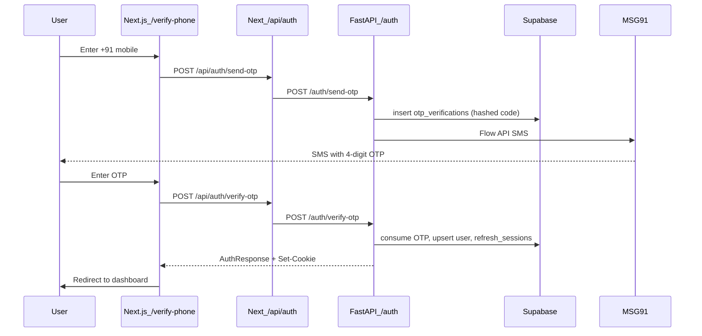

# Phone OTP Auth (MSG91)

Complete guide for BandForge India (+91) phone login/signup via MSG91 SMS OTP.

**Scope:** phone login **or** register with a verified mobile number.  
**Not in scope:** WhatsApp OTP login, or “verify phone on profile” for existing Google users.

---

## 1. Overview

Users enter a 10-digit Indian mobile number, receive a **4-digit** SMS OTP via MSG91 Flow API, then verify the code. On success the API:

1. Creates a new user (if phone is new) or loads the existing user
2. Sets `users.phone_verified_at`
3. Issues JWT access + refresh tokens
4. Sets httpOnly cookies `bf_access` and `bf_refresh`

Primary auth remains Google OAuth. Phone OTP is **feature-flagged** and off by default.



---

## 2. Prerequisites checklist

Before enabling or testing:

| # | Requirement | Notes |
|---|-------------|--------|
| 1 | Auth migration applied | `backend/supabase/migrations/20260519120000_auth_tables.sql` — needs `otp_verifications`, `users.phone`, `users.phone_verified_at`, `refresh_sessions` |
| 2 | Backend running | FastAPI with valid `SUPABASE_*`, `JWT_SECRET`, `JWT_REFRESH_SECRET` |
| 3 | Frontend running | Next.js with `API_URL` / `NEXT_PUBLIC_API_URL` pointing at the API |
| 4 | Feature flags | Backend `PHONE_OTP_ENABLED=true` and frontend `NEXT_PUBLIC_PHONE_OTP_ENABLED=true` |
| 5 | MSG91 account | Auth key + approved Flow template (for real SMS) |
| 6 | India number | App accepts only +91 mobiles starting with 6–9 |

---

## 3. Environment variables

### Backend (`backend/.env`)

| Variable | Required | Default | Purpose |
|----------|----------|---------|---------|
| `PHONE_OTP_ENABLED` | Yes to enable | `false` | Gate for send/verify OTP APIs |
| `MSG91_AUTH_KEY` | Prod / real SMS | `""` | MSG91 authkey header |
| `MSG91_TEMPLATE_ID` | Prod / real SMS | `""` | MSG91 Flow template id |
| `AUTH_DEMO_OTP` | Local only | `""` | Fixed OTP code when set (e.g. `1234`) |
| `AUTH_DEMO_OTP_ENABLED` | Local only | `true` | Allows demo/skip behaviour outside strict prod |
| `AUTH_OPEN_OTP` | Local only | `false` | If true **and** demo mode: any code accepted |
| `APP_ENV` | — | — | `production` requires MSG91 keys when OTP is used |

### Frontend

| Variable | Required | Default | Purpose |
|----------|----------|---------|---------|
| `NEXT_PUBLIC_PHONE_OTP_ENABLED` | Yes to show UI | `false` | Shows `/verify-phone` and login/signup phone links |
| `NEXT_PUBLIC_API_URL` / `API_URL` | Yes | — | Backend base URL for BFF proxy |

### Local demo (no real SMS)

```bash
# backend/.env
PHONE_OTP_ENABLED=true
AUTH_DEMO_OTP=1234
AUTH_DEMO_OTP_ENABLED=true
# MSG91 keys optional — SMS is skipped in non-production when unset

# frontend/.env
NEXT_PUBLIC_PHONE_OTP_ENABLED=true
```

Restart both API and Next.js after changing env. Frontend flag is build/runtime `NEXT_PUBLIC_*` — restart the Next process.

### Real MSG91 SMS (local or staging)

```bash
# backend/.env
PHONE_OTP_ENABLED=true
MSG91_AUTH_KEY=<your-authkey>
MSG91_TEMPLATE_ID=<your-flow-template-id>
AUTH_DEMO_OTP_ENABLED=false
AUTH_OPEN_OTP=false
AUTH_DEMO_OTP=

# frontend
NEXT_PUBLIC_PHONE_OTP_ENABLED=true
```

### Production

```bash
PHONE_OTP_ENABLED=true
MSG91_AUTH_KEY=...
MSG91_TEMPLATE_ID=...
AUTH_DEMO_OTP_ENABLED=false
AUTH_OPEN_OTP=false
AUTH_DEMO_OTP=
APP_ENV=production
NEXT_PUBLIC_PHONE_OTP_ENABLED=true
```

In production, missing MSG91 credentials causes send to fail with **503**.

---

## 4. MSG91 setup

### What BandForge calls

```http
POST https://control.msg91.com/api/v5/flow/
Content-Type: application/json
authkey: <MSG91_AUTH_KEY>

{
  "template_id": "<MSG91_TEMPLATE_ID>",
  "short_url": "0",
  "recipients": [
    {
      "mobiles": "91XXXXXXXXXX",
      "otp": "1234"
    }
  ]
}
```

Implementation: [`backend/app/auth/sms.py`](../app/auth/sms.py).

### Template requirements

1. Use MSG91 **Flow** API (not legacy SendOTP unless you change code).
2. Template variable **must be named exactly `otp`** (matches JSON key `"otp"`).
3. Message should display a **4-digit** code (`OTP_LENGTH = 4`).
4. India DLT / sender ID must be approved if MSG91 requires it for your account.
5. Test with a real +91 handset you control.

### If MSG91 returns errors

Check backend logs for lines like `MSG91 error <status>: ...`. Common causes:

- Wrong authkey or template id
- Template variable not named `otp`
- DLT / sender not approved
- Insufficient MSG91 balance
- Invalid mobile format (we always send `91` + 10 digits)

---

## 5. BandForge APIs

Base path on FastAPI: `/auth`  
Browser / Next client usually calls the BFF proxy: `/api/auth/...` → same backend routes.

### 5.1 Send OTP

| | |
|--|--|
| **Method** | `POST` |
| **Backend** | `/auth/send-otp` |
| **Via Next** | `/api/auth/send-otp` |
| **Auth** | None |
| **Rate limit** | 5 requests per phone per 900s; also 60s resend cooldown per phone |

**Request**

```json
{
  "phone": "9876543210"
}
```

Phone may also be `+919876543210` or `919876543210`; it is normalized to 10 digits. Must match Indian mobile `^[6-9]\d{9}$`.

**Success `200`**

```json
{
  "ok": true,
  "message": "OTP sent."
}
```

In demo mode, `message` may be a hint such as:

```text
Demo mode: use the configured demo OTP or any 6-digit code if open OTP is enabled.
```

(Copy may still mention older wording; the live OTP length is **4**.)

**Errors**

| Status | When |
|--------|------|
| `422` | Invalid phone |
| `429` | Resend cooldown or per-phone rate limit |
| `503` | `PHONE_OTP_ENABLED=false`, MSG91 missing in production, SMS send failed, or OTP storage unavailable |

### 5.2 Verify OTP

| | |
|--|--|
| **Method** | `POST` |
| **Backend** | `/auth/verify-otp` |
| **Via Next** | `/api/auth/verify-otp` |
| **Auth** | None |
| **Rate limit** | Shared login IP limit (10 / 60s) |

**Request**

```json
{
  "phone": "9876543210",
  "code": "1234"
}
```

`code` must be exactly **4** digits.

**Success `200`**

```json
{
  "user": {
    "id": "…",
    "email": null,
    "full_name": null,
    "phone": "+919876543210",
    "email_verified": false,
    "phone_verified": true,
    "role": "student",
    "is_active": true
  },
  "access_token": "…",
  "refresh_token": "…",
  "token_type": "bearer",
  "expires_in": 900
}
```

Also sets httpOnly cookies:

- `bf_access` — access JWT (~15 min)
- `bf_refresh` — refresh JWT (~30 days)

**Behaviour**

- Correct OTP → find user by `phone` (`+91…`) or **insert** new user with verified phone
- Sets `phone_verified_at`
- Creates `refresh_sessions` row and returns tokens

**Errors**

| Status | When |
|--------|------|
| `422` | Invalid phone or OTP length |
| `401` | Wrong / expired / missing OTP |
| `429` | Too many verify attempts on the OTP record, or IP login rate limit |
| `503` | Phone OTP disabled |

### curl examples (direct API)

```bash
# Send
curl -sS -X POST http://127.0.0.1:8000/auth/send-otp \
  -H 'Content-Type: application/json' \
  -d '{"phone":"9876543210"}'

# Verify (save cookies)
curl -sS -X POST http://127.0.0.1:8000/auth/verify-otp \
  -H 'Content-Type: application/json' \
  -c /tmp/bf-cookies.txt \
  -d '{"phone":"9876543210","code":"1234"}'

# Session check
curl -sS http://127.0.0.1:8000/auth/me -b /tmp/bf-cookies.txt
```

---

## 6. Frontend UX

| Path | Behaviour |
|------|-----------|
| `/login`, `/signup` | When flag on: link “Sign in/up with phone” → `/verify-phone` |
| `/verify-phone` | When flag off: unavailable message + link to Google login |
| `/verify-phone` | When flag on: phone step → 4-digit OTP step → dashboard |

Client helpers: `sendOtp` / `verifyOtp` in [`frontend/lib/auth.ts`](../../frontend/lib/auth.ts).  
Flag: `isPhoneOtpEnabled()` in [`frontend/lib/flags.ts`](../../frontend/lib/flags.ts).

---

## 7. OTP rules (constants)

From [`backend/app/auth/constants.py`](../app/auth/constants.py):

| Constant | Value | Meaning |
|----------|-------|---------|
| `OTP_LENGTH` | `4` | Digits in code |
| `OTP_EXPIRE_MINUTES` | `5` | Code lifetime |
| `OTP_MAX_ATTEMPTS` | `5` | Wrong guesses before lock |
| `OTP_RESEND_COOLDOWN_SECONDS` | `60` | Min wait between sends per phone |
| `OTP_RATE_LIMIT_PER_PHONE` | `5` | Max sends per window |
| `OTP_RATE_LIMIT_WINDOW_SECONDS` | `900` | Window (15 min) |
| `OTP_PURPOSE_LOGIN` | `login` | Purpose used for auth OTP |

Codes are stored as **SHA-256 hashes** in `otp_verifications`; plaintext is only sent via SMS (or used as `AUTH_DEMO_OTP` in demo).

---

## 8. Database

Migration: [`20260519120000_auth_tables.sql`](../supabase/migrations/20260519120000_auth_tables.sql).

**`users`**

- `phone` — E.164 `+91XXXXXXXXXX` (unique when not null)
- `phone_verified_at` — set on successful OTP verify

**`otp_verifications`**

- `phone` — 10-digit India number (as stored by OTP layer)
- `code_hash`, `purpose`, `attempts`, `max_attempts`, `expires_at`, `consumed_at`

**`refresh_sessions`**

- Created on successful verify (same as Google login)

Confirm in Supabase SQL Editor that tables/columns exist before testing.

---

## 9. Key source files

| File | Role |
|------|------|
| `backend/app/auth/routes.py` | HTTP handlers + cookies |
| `backend/app/auth/service.py` | `send_phone_otp` / `verify_phone_otp` |
| `backend/app/auth/otp.py` | Create/verify OTP, cooldown, prod MSG91 guard |
| `backend/app/auth/sms.py` | MSG91 Flow HTTP client |
| `backend/app/auth/schemas.py` | Request validation (+91, 4-digit code) |
| `backend/app/security/rate_limit.py` | `enforce_send_otp_rate_limit` |
| `frontend/app/(auth)/verify-phone/*` | OTP UI |
| `frontend/lib/auth.ts` | `sendOtp` / `verifyOtp` |
| `frontend/app/api/auth/[...path]/route.ts` | BFF proxy to FastAPI |

---

## 10. Testing guide

### A. Automated tests

```bash
cd backend
.venv/bin/python -m pytest tests/auth/test_otp.py tests/auth/test_otp_routes.py tests/security/test_rate_limit.py -q
```

Covers: disabled → 503, enabled send/verify (mocked), cooldown, invalid OTP, send-otp rate limit.

### B. Manual — demo mode (no SMS)

1. Set local demo env (section 3).
2. Restart API + frontend.
3. Open `/login` → **Sign in with phone**.
4. Enter a valid test mobile (e.g. `9876543210`).
5. Enter demo code `1234`.
6. Confirm redirect to dashboard and cookies `bf_access` / `bf_refresh`.

### C. Manual — real MSG91

1. Set real MSG91 env; disable demo OTP.
2. Use your real +91 number.
3. Send OTP → SMS should arrive within ~30s.
4. Verify with SMS code → session established.
5. If send returns 503, inspect API logs for `MSG91 error`.

### D. Abuse checks

- Second send within 60s → `429`
- More than 5 sends in 15 minutes for same phone → `429`
- Wrong code repeatedly → attempts increment; after max → `429`

---

## 11. Rollout order

1. **Code** — already implemented (flag-gated routes, UI, rate limits, prod MSG91 guard).
2. **Local demo** — flags + `AUTH_DEMO_OTP` smoke.
3. **Staging + MSG91** — real SMS to one test number.
4. **Production** — flip flags + MSG91 secrets; keep demo/open OTP **off**.

---

## 12. Out of scope / follow-ups

- WhatsApp OTP for login (Meta WhatsApp in this repo is for speaking-release **notifications** only)
- `OTP_PURPOSE_VERIFY_PHONE` — linking/verifying a phone on an existing Google account
- International numbers (non-+91)

---

## 13. Quick troubleshooting

| Symptom | Likely cause |
|---------|----------------|
| `/verify-phone` says unavailable | `NEXT_PUBLIC_PHONE_OTP_ENABLED` not `true` or Next not restarted |
| Send returns 503 “not enabled” | `PHONE_OTP_ENABLED=false` |
| Send returns 503 “MSG91” / “Could not send” | Missing keys in production, bad template, or MSG91 HTTP error |
| Send 200 but no SMS | Demo mode / keys empty in development (SMS skipped) |
| Verify 401 | Wrong code, expired (>5 min), or already consumed |
| Verify 422 | Code not exactly 4 digits |
| No “Sign in with phone” on login | Frontend flag off |
| OTP table errors | Auth migration not applied |
