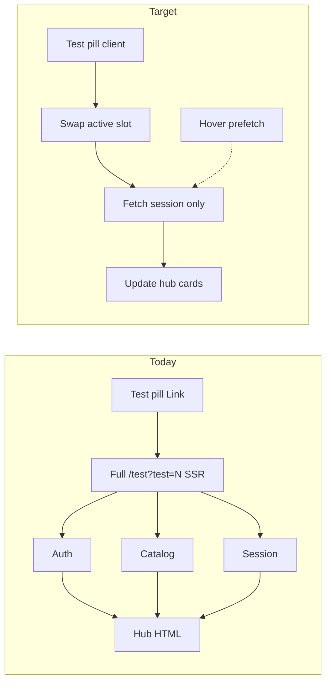

# BandForge — Student Mock UX Optimization Plan

> Planning document only. No implementation steps are assumed complete unless noted under **Already landed**.

**Scope:** Student full-mock journey — hub → Listening / Reading / Writing / Speaking → checkpoint / results — plus shared auth/session infra every mock page depends on.

**Out of scope (later):** Admin builder performance, full practice-hub redesign, diagnostic parity, edge/CDN catalog without auth redesign.

---

## Goals

Make opening and switching mocks, taking modules, and viewing results feel:

1. **Correct** — no broken attempt states or silent failures  
2. **Fast** — warm paths under clear latency budgets  
3. **Seamless** — switching Test 1 / 2 / 3 without a full blank reload  
4. **Accessible** — keyboard, focus, and loading announcements work end-to-end  

---

## Success budgets (warm)

| Experience | Target |
|------------|--------|
| Switch Test 1 / 2 / 3 (perceived) | &lt; 400ms (no full blank SSR) |
| Hub shell first paint | &lt; 500ms |
| Session cards filled | &lt; 800ms |
| Catalog API | &lt; 200ms |
| Session API | &lt; 300ms |
| Start / resume → exam route | &lt; 1.5s |
| Checkpoint / module-review / summary | &lt; 1s cached, &lt; 2s cold |

Also:

- Never show `mock_attempts.status = completed` while enabled modules are still `in_progress`
- Never treat catalog/session API failure as “coming soon”

---

## Already landed

- Removed double catalog + session fetches on `/test` hub SSR  
- Parallelized auth + catalog + session on first load (Test 1/2 known UUIDs)  
- Backend catalog list caching (~60s) + batch module load  
- Catalog cache invalidation on admin create / update / publish / delete  

---

## Current vs target navigation

---

## Measured bottlenecks (baseline)

From live local benches (auth as product user):

| Route / path | Warm latency | Notes |
|--------------|--------------|-------|
| Hub SSR `/test?test=N` | ~4.7–5s before fix | Double-fetched catalog + session |
| `GET /catalog` | ~1.2s → ~270ms warm after cache | Still cold ~1s after restart |
| `GET /session` | ~0.5s warm, up to ~3–7s cold | Cache helps |
| `GET /summary` | ~7s | Heaviest results path |
| `GET /checkpoint` | ~4.6s | Rebuilds too much |
| `*/module-review` | ~3.5–4.6s | Per-skill review |
| `POST` start / resume | ~3.3s start | Click-to-exam cost |
| `GET /practice/mock-unlock` | ~500ms → **500** | Missing `practice_hubs` |

---

## Phase 0 — Correctness blockers

Ship before more speed work; otherwise fast UIs still feel broken.

### 0.1 Mock completion integrity

**File:** `backend/app/services/mock_orchestrator.py`

- Do not mark the mock `completed` when the last *catalog-order* module finishes if earlier enabled modules are unfinished (seen on Test 3: speaking completed → whole attempt `completed` while reading/writing still `in_progress`).
- Complete only when all enabled modules are `completed` (same idea as the repair gate in `_progress_from_context`).
- Repair path: if row is `completed` but modules are not, reopen to `in_progress` and clear `completed_at`.

### 0.2 Practice unlock

**File:** `backend/app/practice/router.py` (+ migration or soft-fail)

- `GET /api/practice/mock-unlock` currently 500s (`public.practice_hubs` missing).
- Apply migration or return a safe `MockUnlockOut` so dashboard/practice does not hard-fail.

### 0.3 Duration consistency

**File:** `backend/app/schemas/test_engine.py` (+ start payload builders)

- `TestSummary.reading_duration_minutes` must come from `mock_test_modules`, not default `60`.
- Hub timers and start/resume must agree.

### 0.4 Visible API failures

**File:** `frontend/lib/mock-server.ts` (+ hub shell)

- Catalog/session failure must not render as empty / coming soon.
- Show error + retry in the hub shell.

---

## Phase 1 — Seamless test switching

Highest perceived UX win.

**Files:**

- `frontend/app/(test)/test/page.tsx`
- `frontend/modules/mock/components/mock-test-picker-grid.tsx`
- `frontend/modules/mock/components/mock-test-hub-shell.tsx`
- `frontend/modules/mock/components/mock-tests-unified.tsx`
- `frontend/modules/mock/hooks/use-mock-session.ts`
- `frontend/modules/mock/lib/mock-session-fetch.ts`

### 1.1 Client-side test switch

- Keep catalog slots in memory in the hub shell.
- Pill click: `router.replace(/test?test=N)` + swap `activeNumber` without a full RSC catalog re-fetch.
- Fetch **session only** for the selected `mockTestId`.

### 1.2 Prefetch on hover / focus

- Prefetch session for adjacent live slots.
- Warms backend `mock_session:v2` cache.

### 1.3 Skeleton-first hub

- Show picker + title immediately.
- Module cards use skeleton until session returns (`MockTestHubSkeleton`).

### 1.4 SSR as bootstrap only

- First load still SSR-hydrates catalog + active session.
- Later switches are client-led.

---

## Phase 2 — Shared infra speed

1. **Auth micro-cache** — short TTL for `getCachedServerSession` / user resolve (today often 0.5–1.3s).  
2. **Catalog** — keep 60s backend cache; confirm admin publish/delete still invalidates (`_invalidate_picker_catalog`).  
3. **Session / progress** — ensure cache writes on start/submit; prefetch active + neighbors from hub.  
4. **Start / resume slim path** — `POST /api/mock-attempts` already returns `progress`; avoid a redundant client `progress()` call right after start when the payload includes it.

---

## Phase 3 — Results / checkpoint / reviews

Target: 3–7s → &lt; 2s cold, &lt; 1s cached.

**Files:**

- `backend/app/services/mock_orchestrator.py` (`get_summary`, `get_checkpoint`)
- `backend/app/services/module_review.py`
- `frontend/modules/mock/components/mock-results.tsx`
- module-review client components

1. **Summary** — RPC or batched query; cache 30–60s by attempt; invalidate on module submit / speaking release.  
2. **Checkpoint** — reuse cached progress + score row; avoid full bundle rebuild when possible.  
3. **Module-review cache** — cache L/R/W/S review payloads; invalidate per module on submit.  
4. **Progressive UI** — results shell + bands first; review groups load after.

---

## Phase 4 — Accessibility and polish

1. **Focus** — on client test switch, move focus to hub heading; keep pill `tablist` semantics.  
2. **Loading** — `aria-busy` / live region while session loads.  
3. **Errors** — retry for catalog / session / start; no dead ends.  
4. **Navigation** — consistent back targets from section results → hub.  
5. **Measurement** — keep `perfLog("test-page-ssr")`; add a small smoke check for catalog/session p95 budgets.

---

## Implementation order

1. Phase 0 — correctness  
2. Phase 1 — client test switch + prefetch + skeletons  
3. Phase 2 — auth / session / start trim  
4. Phase 3 — summary / checkpoint / review caching + progressive UI  
5. Phase 4 — a11y + measurement gates  

---

## Primary file index

### Frontend

| Path | Role |
|------|------|
| `frontend/app/(test)/test/page.tsx` | Hub SSR bootstrap |
| `frontend/lib/mock-server.ts` | Server catalog/session fetch |
| `frontend/modules/mock/components/mock-test-picker-grid.tsx` | Test 1–5 switcher |
| `frontend/modules/mock/components/mock-tests-unified.tsx` | Hub composition |
| `frontend/modules/mock/components/mock-test-hub.tsx` | Module cards / actions |
| `frontend/modules/mock/hooks/use-mock-session.ts` | Start / resume / session client |
| `frontend/modules/mock/components/mock-results.tsx` | Aggregate results |

### Backend

| Path | Role |
|------|------|
| `backend/app/routers/mock_attempts.py` | Mock orchestration API |
| `backend/app/services/mock_orchestrator.py` | Progress, session, summary, complete |
| `backend/app/services/module_review.py` | Module review payloads |
| `backend/app/practice/router.py` | Practice mock unlock |
| `backend/app/admin/mocks.py` | Catalog cache invalidation |

---

## Checklist (tracking)

- [ ] Phase 0.1 — completion integrity + repair  
- [ ] Phase 0.2 — practice unlock  
- [ ] Phase 0.3 — duration consistency  
- [ ] Phase 0.4 — hub error surfacing  
- [ ] Phase 1 — client switch + prefetch + skeletons  
- [ ] Phase 2 — auth/session/start infra  
- [ ] Phase 3 — results path caching + progressive UI  
- [ ] Phase 4 — a11y + perf smoke budgets  

---

*Last updated: 2026-07-30*
